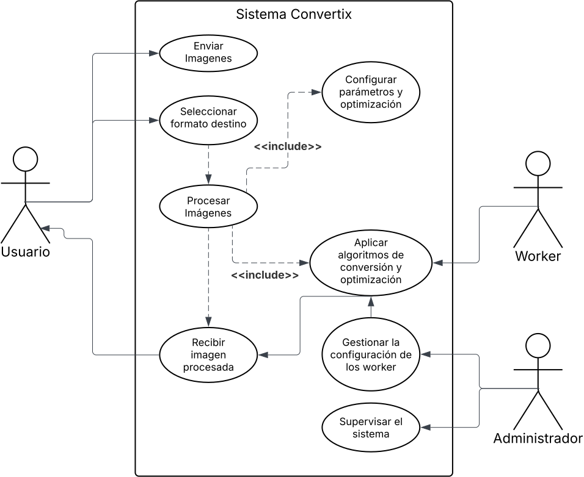
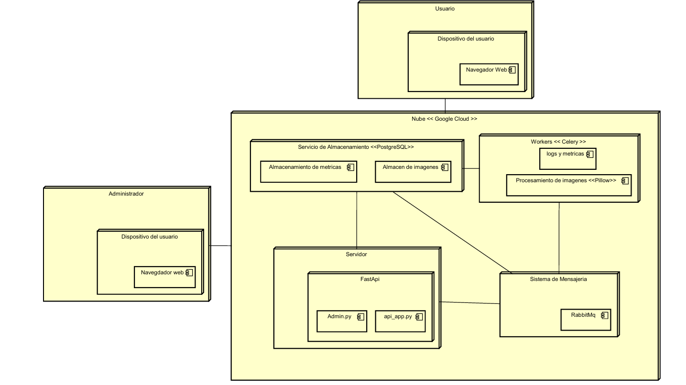

# Sistema Distribuido para Conversión de Imágenes

Este proyecto implementa un **sistema distribuido** para la conversión de imágenes, diseñado para escalar de manera dinámica, tolerar fallos y mantener una alta disponibilidad. La arquitectura se basa en la separación de responsabilidades, donde cada componente se ejecuta en contenedores Docker independientes. Esto permite que la aplicación gestione eficientemente peticiones concurrentes y distribuya la carga de procesamiento de forma óptima.

## Descripción del Sistema

El sistema se compone de los siguientes servicios:

- **FastAPI:**  
  Servidor que recibe peticiones HTTP/HTTPS de los clientes. Se encarga de la autenticación y delega el procesamiento pesado (conversión de imágenes) a través de la publicación de tareas en la cola de mensajes.

- **RabbitMQ:**  
  Sistema de mensajería que actúa como intermediario. Las tareas publicadas por FastAPI se almacenan en colas persistentes con soporte para _dead-letter queues (DLQ)_ para el manejo de errores.

- **Auto Scaling Manager:**  
  Supervisión de la cola de RabbitMQ y escalado dinámico de workers en función de la demanda. Permite que se desplieguen más contenedores de workers cuando el volumen de tareas aumenta.

- **Workers:**  
  Servicios autoescalables que procesan la conversión de imágenes. Estos contenedores pueden hacer uso de CPU o GPU según la carga de trabajo.

- **Almacenamiento de Imágenes:**  
  Sistema compartido (contenedor o volumen persistente) para guardar las imágenes procesadas, facilitando el acceso y la integración con otros servicios.

- **Monitorización & Logging:**  
  Componente encargado de recopilar métricas, logs y eventos de todos los servicios, lo que permite hacer trazabilidad y análisis en tiempo real.

### Caracteristicas del sistema

Este proyecto se clasifica como un sistema distribuido debido a que:

- **Desacoplamiento de Componentes:**  
  Cada servicio se ejecuta de forma independiente en contenedores, permitiendo actualizaciones y escalabilidad sin afectar el sistema en su totalidad.

- **Escalabilidad y Concurrencia:**  
  La capacidad de escalar dinámicamente los workers según la carga en RabbitMQ permite procesar múltiples tareas en paralelo.

- **Tolerancia a Fallos:**  
  RabbitMQ gestiona colas persistentes y dispone de DLQ para tratar errores en el procesamiento, lo que garantiza la resiliencia del sistema.

- **Monitorización y Transparencia:**  
  El sistema centralizado de logs y métricas proporciona una visión integral de la salud y el rendimiento de cada componente.

- **Comunicación Mediante Protocolos Estandarizados:**  
  La interacción entre servicios se realiza mediante REST (con FastAPI) y AMQP (con RabbitMQ), facilitando la integración y el mantenimiento.

## Diagramas del Sistema

### Diagrama de casos de uso 
Este diagrama muestra los casos de uso de la aplicación Convertix.

### Diagrama de Secuencia del Proceso 
Este diagrama ilustra el flujo temporal del procesamiento de una solicitud, desde la autenticación en FastAPI hasta la notificación al cliente, incluyendo la gestión de errores:

### Diagrama de Despliegue (Deployment)
El siguiente diagrama muestra cómo se despliegan los componentes.

## Interfaces de usuario
 
 

[Figma del proyecto - Ver diseño en Figma](https://www.figma.com/design/hI5xVxAdqeYuA0gS1xTrT8/Convertix?node-id=0-1&t=fHzxOyDQZ137G8LF-1)

## Como ejecutar el proyecto
Para ejecutar el proyecto se requieren los siguientes pasos
1. Crear la base de datos Convertix de PostgreSQL
2. Levanta el docker de Rabbitmq y dejar los puertos expuestos
3. Activar Celery
4. Ejecutar el servidor de FastApi
5. Acceder a Index.hmtl

## Colaboradores

